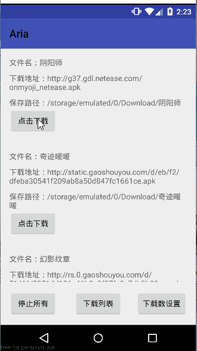
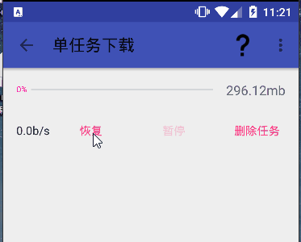
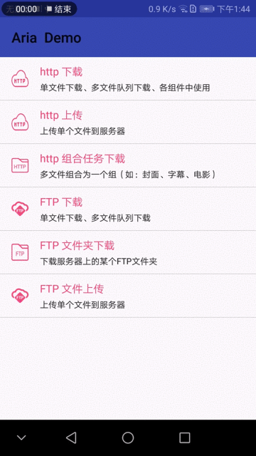
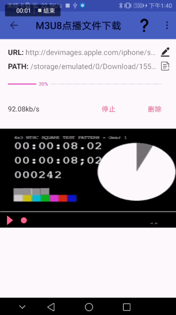

# Aria
</br>
## [ENGLISH DOC](ENGLISH_README.md)</br>
## [中文文档](https://aria.laoyuyu.me/aria_doc)
> [!caution]
>
> [原仓库](https://github.com/AriaLyy/Aria)已删库，这是备份仓库
>
> 作者原话：因Aria被诈骗份子使用，导致我被跨省，因此本项目源码永久删除。最后说一句，诈骗份子死全家，奉劝给诈骗份子写代码的逼人和狗，别他妈用开源代码，害了广大开源作者。

中文文档：https://qaz64.github.io/aria_doc/api/task_handle.html

Aria项目源于工作中遇到的一个文件下载管理的需求，当时被下载折磨的痛不欲生，从那时起便萌生了编写一个简单易用，稳当高效的下载框架，aria经历了1.0到3.0的开发，算是越来越接近当初所制定的目标了。

Aria有以下特点：
 + 简单、方便
   - 可以在Activity、Service、Fragment、Dialog、popupWindow、Notification等组件中使用
   - 支持HTTP\FTP断点续传下载、多任务自动调度
   - 支持多文件打包下载，多文件共享同一进度（如：视频 + 封面 + 字幕）
   - 支持下载FTP文件夹
   - 支持HTTP表单上传
   - 支持文件FTP断点续传上传
   - 支持FTPS断点续传，[see](https://aria.laoyuyu.me/aria_doc/api/ftp_params.html#%E4%BA%8C%E3%80%81ftps)
   - 支持SFTP断点续传，[sftp下载](https://aria.laoyuyu.me/aria_doc/download/sftp_normal.html)，[sftp上传](https://aria.laoyuyu.me/aria_doc/upload/sftp_normal.html)
 + 支持https地址下载
   - 在配置文件中很容易就可以设置CA证书的信息
 + 支持[多线程分块下载](https://aria.laoyuyu.me/aria_doc/start/config.html)，能更有效的发挥机器IO性能
 + 支持300、301、302重定向下载链接下载
 + 支持m3u8、hls协议的文件下载[m3u8下载](https://aria.laoyuyu.me/aria_doc/download/m3u8.html)
 + 支持m3u8边下边看的下载支持，[点击查看详情](https://aria.laoyuyu.me/aria_doc/download/m3u8_vod.html)
 + 下载支持文件长度动态增加，文件下载初始化时将不再占用过多的内存空间，见[动态长度配置](https://aria.laoyuyu.me/aria_doc/start/config.html#%E4%B8%8B%E8%BD%BD%E5%8A%A8%E6%80%81%E6%96%87%E4%BB%B6%E8%AF%B4%E6%98%8E)

[怎样使用Aria?](#使用)

如果你觉得Aria对你有帮助，你的star和issues将是对我最大支持，当然，也非常欢迎你能PR，[PR方法](https://www.zhihu.com/question/21682976/answer/79489643)`^_^`

## 示例
* 多任务下载



* 速度限制



* 多文件打包下载



* m3u8下载



## 引入库
[](https://github.com/TC999/Aria-bak/blob/master/LICENSE)
[](https://github.com/TC999/Aria-bak)
[](https://github.com/TC999/Aria-bak)
[](https://github.com/TC999/Aria-bak)
[](https://github.com/TC999/Aria-bak)
[](https://github.com/TC999/Aria-bak)


```java
repositories {
  google()
  mavenCentral()
}

dependencies {
  implementation 'me.laoyuyu.aria:core:3.8.16'
  annotationProcessor 'me.laoyuyu.aria:compiler:3.8.16'
  implementation 'me.laoyuyu.aria:ftp:3.8.16' # 如果需要使用ftp，请增加该组件
  implementation 'me.laoyuyu.aria:sftp:3.8.16' # 如果需要使用ftp，请增加该组件
  implementation 'me.laoyuyu.aria:m3u8:3.8.16' # 如果需要使用m3u8下载功能，请增加该组件
}

```

如果你使用的是kotlin，请使用kotlin官方提供的方法配置apt，[kotlin kapt官方配置传送门](https://www.kotlincn.net/docs/reference/kapt.html)

__⚠️注意：3.5.4以下版本升级时，需要更新[配置文件](https://aria.laoyuyu.me/aria_doc/start/config.html)！！__

__⚠️注意：3.8 以上版本已经适配了AndroidX和support库都可以使用

***
## 使用
由于Aria涉及到文件和网络的操作，因此需要你在manifest文件中添加以下权限，如果你希望在6.0以上的系统中使用Aria，那么你需要动态向安卓系统申请文件系统读写权限，[如何使用安卓系统权限](https://developer.android.com/training/permissions/index.html?hl=zh-cn)
```xml
<uses-permission android:name="android.permission.MOUNT_UNMOUNT_FILESYSTEMS"/>
<uses-permission android:name="android.permission.INTERNET"/>
<uses-permission android:name="android.permission.WRITE_EXTERNAL_STORAGE"/>
<uses-permission android:name="android.permission.READ_EXTERNAL_STORAGE"/>
<uses-permission android:name="android.permission.ACCESS_NETWORK_STATE"/>
```

## 使用Aria
### 基本使用
例子为单任务下载，只需要很简单的代码，便可以实现下载功能。
* 创建任务
  ```java
  long taskId = Aria.download(this)
      .load(DOWNLOAD_URL)     //读取下载地址
      .setFilePath(DOWNLOAD_PATH) //设置文件保存的完整路径
      .create();   //创建并启动下载
  ```
* 停止\恢复任务
  ```java
  Aria.download(this)
      .load(taskId)     //读取任务id
      .stop();       // 停止任务
      //.resume();    // 恢复任务

  ```

### 任务状态的获取
基于解耦合的考虑，Aria的下载功能是和状态获取相分离的，状态的获取并不会集成到链式代码中，但是Aria提供了另一种更简单更灵活的方案。
通过注解，你可以很容易获取任务的所有状态。

1. 将对象注册到Aria
```java
protected void onCreate(Bundle savedInstanceState) {
    super.onCreate(savedInstanceState);
    Aria.download(this).register();
}
```

2. 通过注解获取任务执行状态
 **注意：**
 - 注解回掉采用Apt的方式实现，所以，你不需要担心这会影响你机器的性能
 - 被注解的方法**不能被private修饰**
 - 被注解的方法**只能有一个参数，并且参数类型必须是`DownloadTask`或`UploadTask`或`DownloadGroupTask`**
 - 方法名可以为任意字符串
 
```java
//在这里处理任务执行中的状态，如进度进度条的刷新
@Download.onTaskRunning protected void running(DownloadTask task) {
	if(task.getKey().eques(url)){
		....
		可以通过url判断是否是指定任务的回调
	}
	int p = task.getPercent();	//任务进度百分比
    String speed = task.getConvertSpeed();	//转换单位后的下载速度，单位转换需要在配置文件中打开
   	String speed1 = task.getSpeed(); //原始byte长度速度
}

@Download.onTaskComplete void taskComplete(DownloadTask task) {
	//在这里处理任务完成的状态
}
```

### [文档地址](https://aria.laoyuyu.me/aria_doc/)

### QQ群：524329160


### 版本日志
  + v_3.8.16
    - 修复单线程下载时，文件已经完成，重复下载回调下载失败的问题
    - 修复一个重新下载文件时，同名路径文件没有被被删除的问题
    - fix bug https://github.com/AriaLyy/Aria/issues/807
    - fix bug https://github.com/AriaLyy/Aria/issues/811
    - fix bug https://github.com/AriaLyy/Aria/issues/851
    - 修复组合任务在获取子任务信息的过程中，手动停止或删除，没有回调的问题

[更多版本记录](https://github.com/AriaLyy/Aria/blob/master/DEV_LOG.md)

## 混淆配置
```
-dontwarn com.arialyy.aria.**
-keep class com.arialyy.aria.**{*;}
-keep class **$$DownloadListenerProxy{ *; }
-keep class **$$UploadListenerProxy{ *; }
-keep class **$$DownloadGroupListenerProxy{ *; }
-keep class **$$DGSubListenerProxy{ *; }
-keepclasseswithmembernames class * {
    @Download.* <methods>;
    @Upload.* <methods>;
    @DownloadGroup.* <methods>;
}

```

## 感谢
感谢小伙伴们提供的PR ``^_^`
[DaveBoy](https://github.com/DaveBoy)
[liuxiaowei](https://github.com/liuxiaowei)
[chenfei0928](https://github.com/chenfei0928)

## 其他
 有任何问题，可以在[issues](https://github.com/AriaLyy/Aria/issues)给我留言反馈。</br>
 在提交问题前，希望你已经查看过[wiki](https://aria.laoyuyu.me/aria_doc/)或搜索过[issues](https://github.com/AriaLyy/Aria/issues)。</br>
 [我的博客](https://www.laoyuyu.me)

## 捐赠
 Aria是作业利用业余时间开发的一个项目，如果你喜欢我写的软件，可以考虑给我捐赠以支持我的工作</br>
 
 

***

License
-------

    Copyright 2016 AriaLyy(https://github.com/AriaLyy/Aria)

    Licensed under the Apache License, Version 2.0 (the "License");
    you may not use this file except in compliance with the License.
    You may obtain a copy of the License at

       http://www.apache.org/licenses/LICENSE-2.0

    Unless required by applicable law or agreed to in writing, software
    distributed under the License is distributed on an "AS IS" BASIS,
    WITHOUT WARRANTIES OR CONDITIONS OF ANY KIND, either express or implied.
    See the License for the specific language governing permissions and
    limitations under the License.
